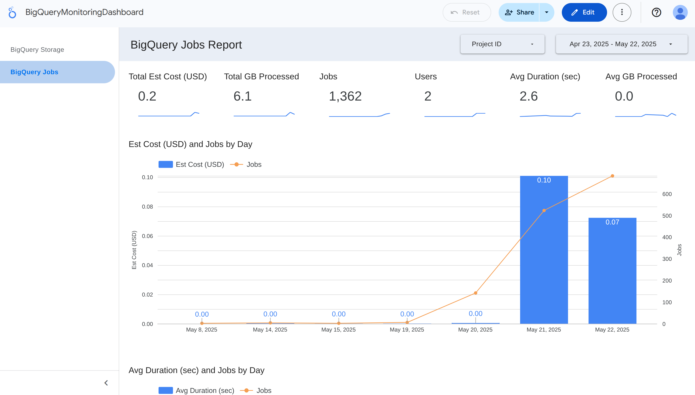
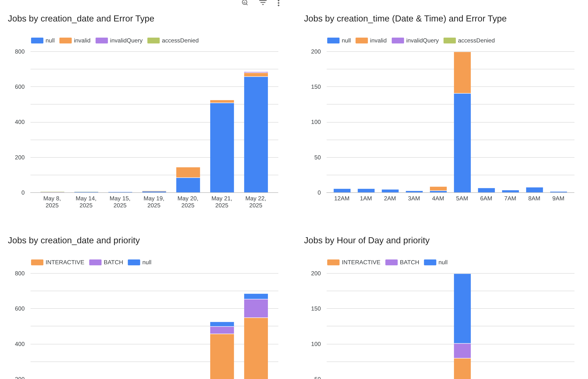
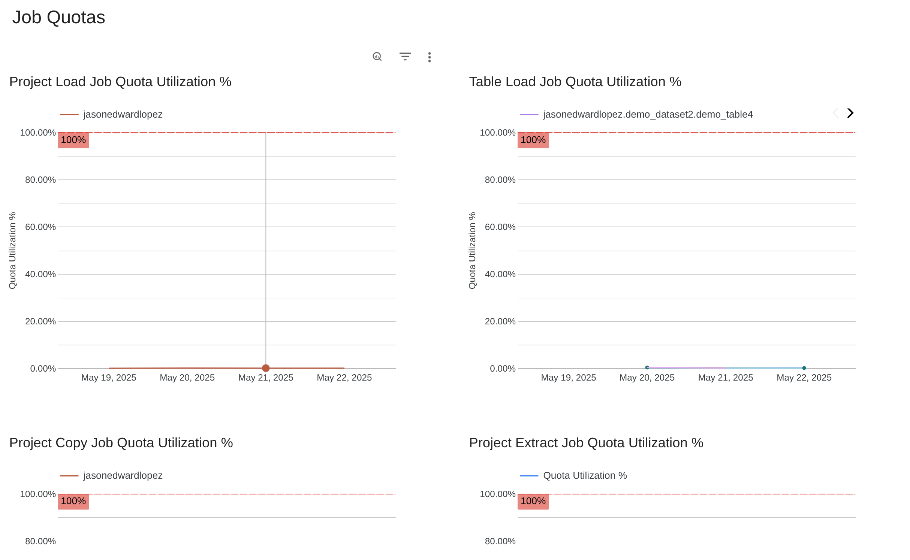
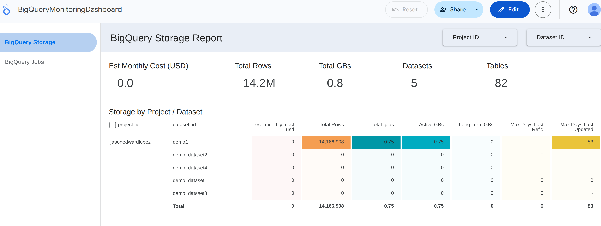
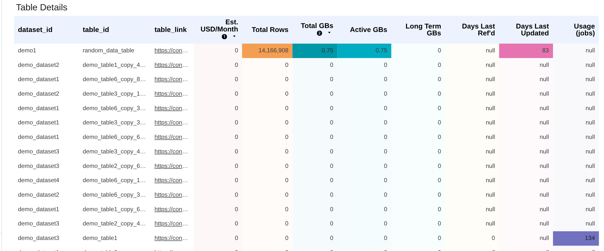

# BigQuery Monitoring Report

A set of SQL View definitions on top of the BigQuery [INFORMATION_SCHEMA](https://cloud.google.com/bigquery/docs/information-schema-intro) views to report on BigQuery cost and performance.

Also includes a template Looker Studio Dashboard - [BigQueryMonitoringDashboard](https://lookerstudio.google.com/reporting/da83c07a-5d81-47cd-9f2e-3b11d093358b)

## Key Features
- Setup script to easily create/update the reporting views and generate a link to automatically create your own copy of the templated Looker Studio Report.
- Storage reports on rows, GBs stored, and estimated monthly cost.
- Recommendations tables for query and table optimizations, tables near partition limits, and job quota limits.
- Jobs reports on queries, job types, and query cost and duration by user and day.
- Supports selecting either GCP Project or Organization scoped reports.
- NOTE: reports are focused on on-demand query pricing.
- NOTE: reports are region-specific (ex. US or EU), you can re-run the setup script and choose a different region to create two sets of side-by-side reporting Views and have two dashboards.

## Setup Instructions!
You can click the below button to start walkthrough script in the GCP Cloud Shell that will ask for the desired region and scope (Project or Org), create the necessary views, and then present a link to create your own Looker Dashboard connected to those reporting views.

#### Manual setup
If you don't want to use the automated setup script, you can manually create all the reporting Views and then copy the template Looker Studio Dashboard and manually edit it to point to your data.
- Copy the SQL files in the [sql](./sql) directory.
- Replace all the templated values in the `FROM` clauses with your desired region and scope (the sql files have notes on what the value should look like). 
  - NOTE: If you're doing a manual setup and using the Organization-level scope (all GCP Projects in an Org), there are a couple extra steps noted in the [Organization Scope Additional Notes](#organization-scope-additional-notes) section.
- Make a copy of the template [BigQueryMonitoringDashboard](https://lookerstudio.google.com/reporting/da83c07a-5d81-47cd-9f2e-3b11d093358b/preview) by following the link, and clicking 'Use my Own Data', then saving the copy.
- After clicking the link you'll be prompted to specify your data sources.

## Reporting Views
- [bigquery_jobs.sql](./sql/bigquery_jobs.sql): Main jobs reporting view.
- [bigquery_job_quota_utilization.sql](./sql/bigquery_job_quota_utilization.sql): Query, Copy, Load, and Extract job quota utilization by day report.
- [bigquery_storage.sql](./sql/bigquery_storage.sql): Main storage reporting view.
- [bigquery_gcp_recommendations.sql](./sql/bigquery_gcp_recommendations.sql): Export of GCP's native BigQuery recommendations table (for exx partitioning or clustering recommendations).

## Organization Scope Additional Notes
Since the underlying dataset information schema table is currently scoped to only a single GCP Project, we use a stored procedure to get all the Projects in an Org, and then build a View union-ing all those together.
**NOTE:** This means you'll need to manually re-run that stored procedure (`CALL CREATE_ORG_SCHEMATA_OPTIONS_VIEW_PROC_REF()`) to get any newly created GCP Projects to be included.
These extra steps are all handled via the automated [setup_report_view.sh](./setup_report_views.sh) script, however if you're doing a manual setup you'll need to follow the below extra steps.

- Copy the [create_update_org_schemata_options_view.sql](./sql/create_update_org_schemata_options_view.sql) SQL script and run it in your BigQuery environment.
  - This creates a stored procedure to fetch all GCP Projects in the Org, then build a View to union all the dataset metadata together.
- Once the above stored procedure is created you can then run the procedure to create the Org-level dataset (`${PROJECT_ID}.${DATASET_ID}.bigquery_org_schemata_options_region_${REGION}`)

## Looker Studio Dashboard
You can use any BI tool to create your own dashboard using the reporting Views here, or you can create a copy of this [BigQueryMonitoringDashboard](https://lookerstudio.google.com/reporting/da83c07a-5d81-47cd-9f2e-3b11d093358b) template dashboard.

